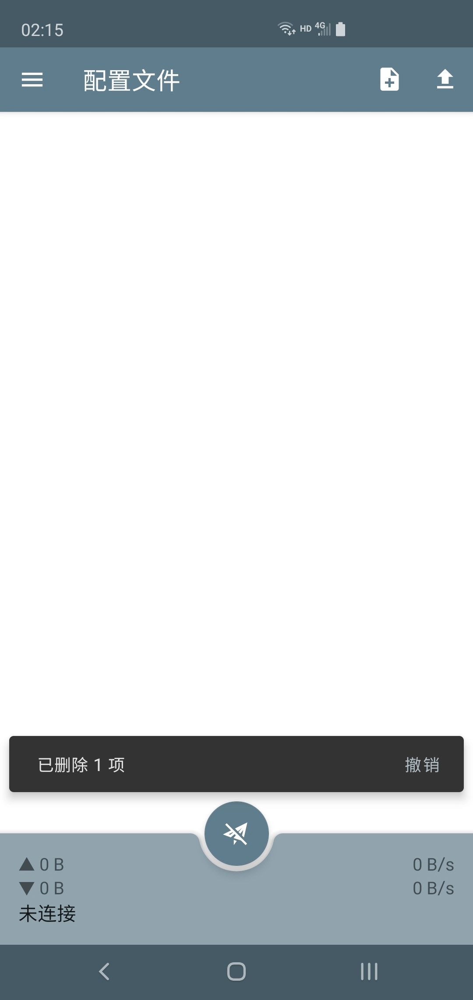
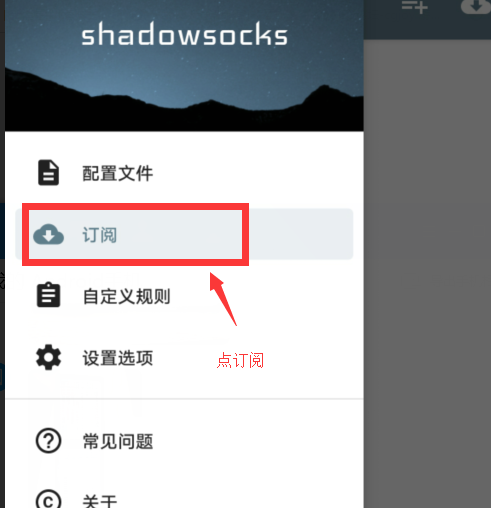
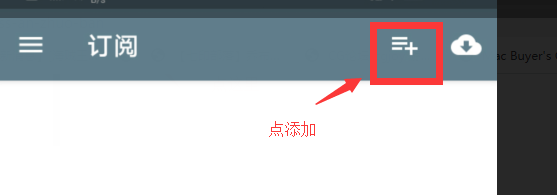
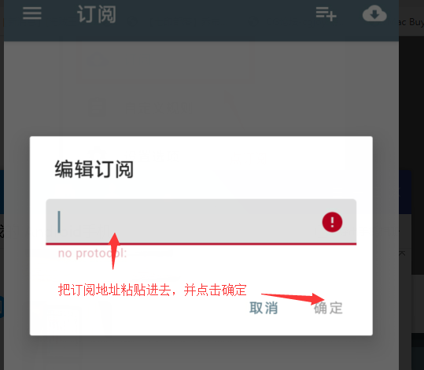
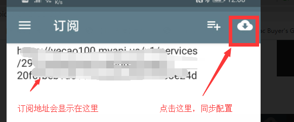
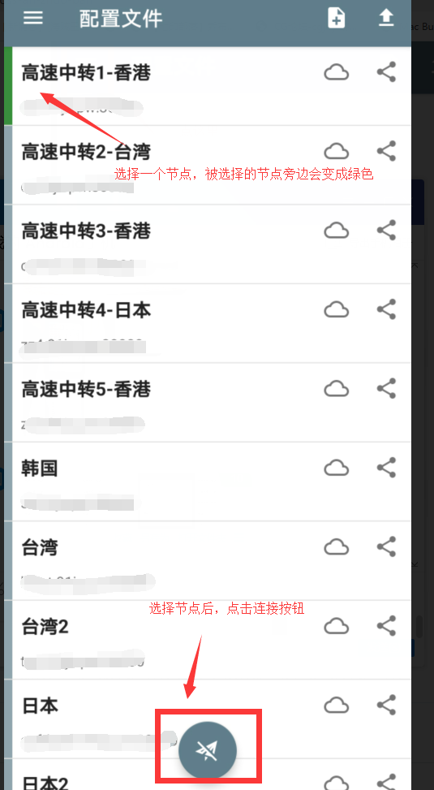
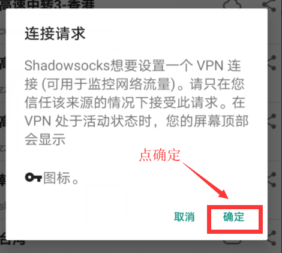

# \(Android\)SS安卓版

## 下载客户端并安装

GitHub下载（下载universal版）：[https://github.com/shadowsocks/shadowsocks-android/releases](https://github.com/shadowsocks/shadowsocks-android/releases)

## 从网站获得安卓版的订阅地址


为了方便手机上复制订阅地址，建议使用手机浏览器访问网站

或者电脑PC上复制完连接后，通过QQ复制传输给手机


## 配置安卓客户端

打开 SS for Android，会发现已经存在一个配置文件。这个配置是主分支团队提供的免费节点，但稳定性极低，且使用此节点时，SS for Android 会显示广告。

