# Android

## 下载客户端并安装

GitHub下载（下载universal版）：[https://github.com/shadowsocks/shadowsocks-android/releases](https://github.com/shadowsocks/shadowsocks-android/releases)

## 从网站获得安卓版的订阅地址


为了方便手机上复制订阅地址，建议使用手机浏览器访问网站

或者电脑PC上复制完连接后，通过QQ复制传输给手机


1. 点击你购买的产品

2. 找到“ss安卓”的按钮

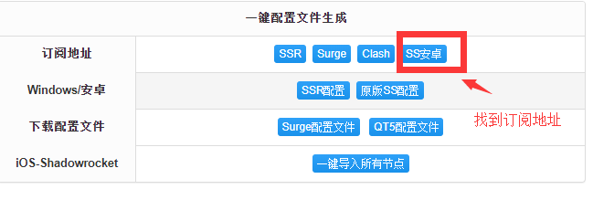

3. 点击“复制订阅地址”复制订阅地址

## 配置安卓客户端

1. 打开 SS for Android，会发现已经存在一个配置文件。这个配置是主分支团队提供的免费节点，但稳定性极低，且使用此节点时，SS for Android 会显示广告。

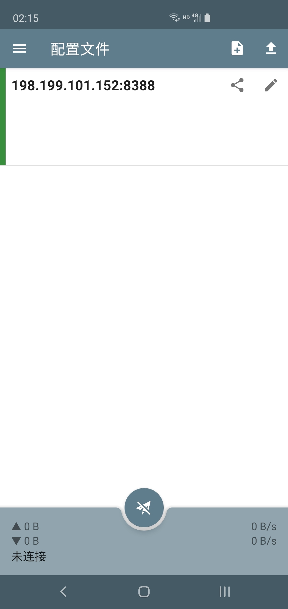

2. 左滑删除默认节点

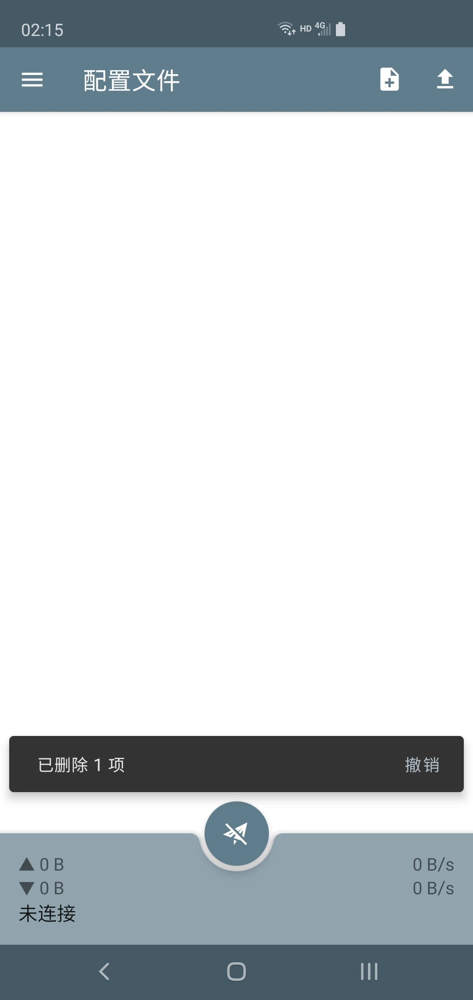

3. 点客户端左上角

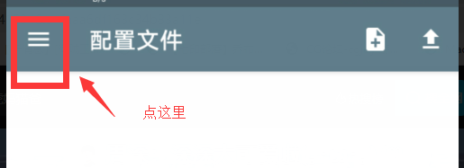

4. 点订阅

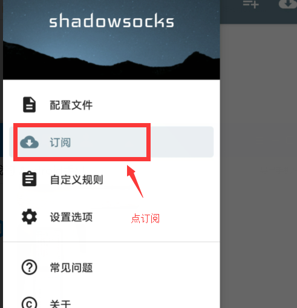

5. 在订阅界面点击右上角的“添加”按钮

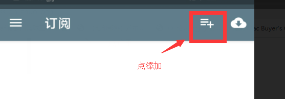

6. 把刚才复制的订阅地址粘贴进输入框里，并点击确定

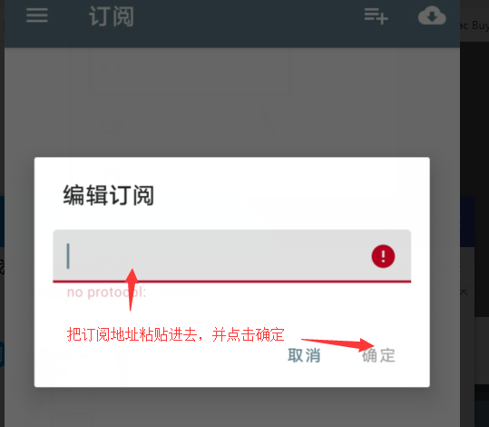

7. 点击右上角的“同步”按钮，同步配置订阅的配置文件

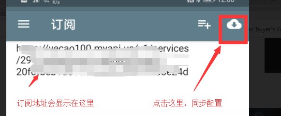

8. 点击左上角的菜单

9. 点击“配置文件”返回配置文件

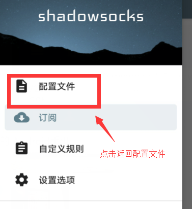

10. 选择一个节点，然后点击“连接”按钮:

11. 如果出现这个提示，点确定

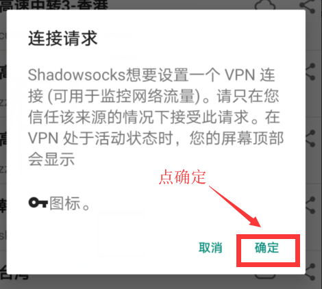

12. 连接成功的话按钮会变绿，点击测试连接的文字

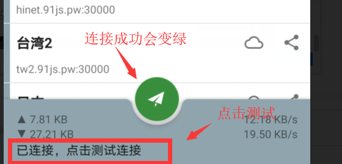

13. 如果显示连接成功，就说明配置成功了

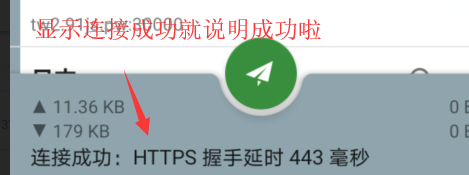

