# Windows

## 下载客户端并安装

GitHub下载：[https://github.com/shadowsocksrr/shadowsocksr-csharp/releases](https://github.com/shadowsocksrr/shadowsocksr-csharp/releases)

## 从网站获取订阅地址

1. 选择你所购买的套餐

2. 找到并选择SSR订阅

3. 复制订阅地址

## 客户端配置

1. 优先选择运行4.0这个，如果报错，则尝试运行2.0这个

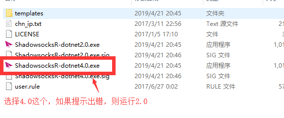

2. 找到任务栏的客户端图标，右键点击图标，记住，是右键！！

3. 选择服务器订阅

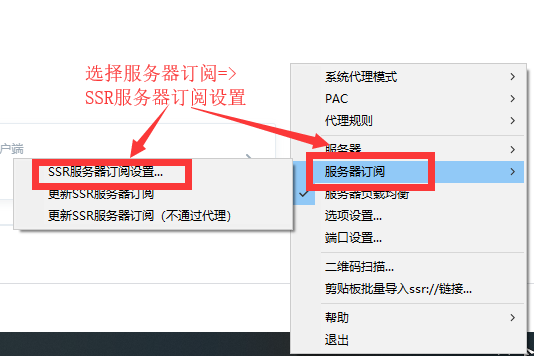

4. 点击ADD后，会有一个带有默认内容的网址，把这个网址删除，并把从网站复制的订阅地址粘贴进去

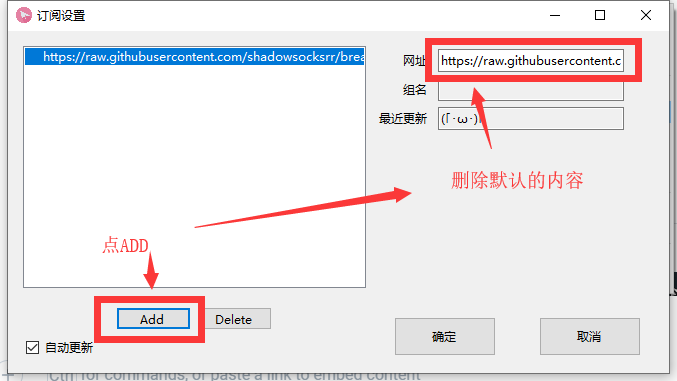

5. 删除默认的内容后，把我们的订阅地址复制进去，并点确定

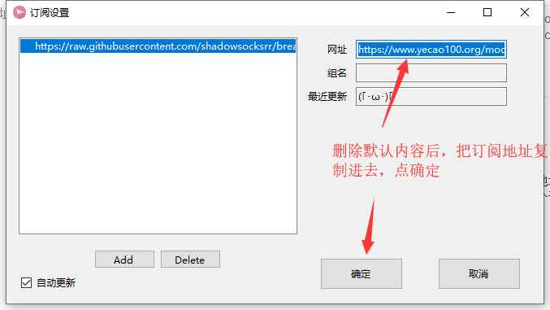

6. 继续右键点击客户端图标，选择”服务器订阅“=》更新SSR服务器订阅（不通过代理）

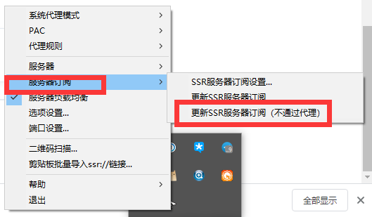

7. 如果更新成功，你会在 ”服务器”菜单里看到“yecao100”的分组

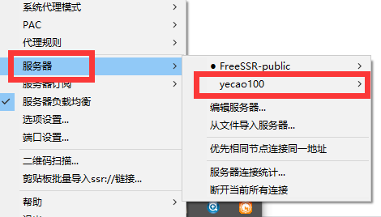

8. 然后选择一个中转节点

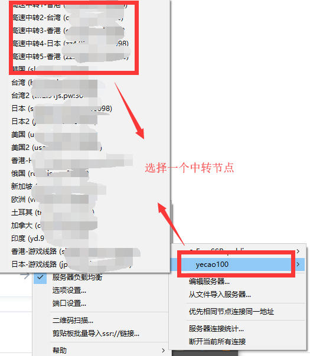

9. 系统代理模式 选择 全局模式

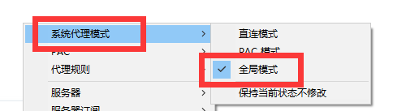

10.代理规则 选择 绕过局域网和大陆

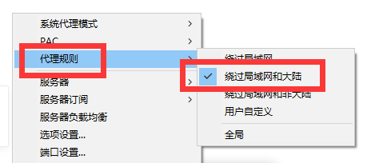

11. 点击”选项设置“

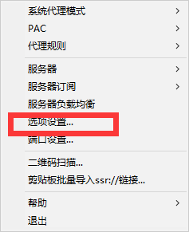

12. 确保这里的选项和图里显示的一致，勾选前2个，取消最后一个。然后点”确定“

13. 如果一切正常的话，这里的客户端图标会显示绿色。

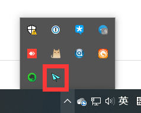

## 退出客户端


如果你发现，不开客户端的情况下无法正常上网，则说明你没有正常退出客户端



请确保每次退出客户端的时候，都是右键点击图标，然后选择”退出“菜单



如果不开客户端的时候无法上网，请再打开一下客户端，然后重新退出


请确保每次都是通过右键菜单正常退出客户端:

