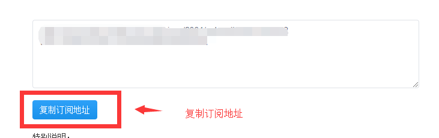

# iOS

## 下载客户端并安装


需要注意的是，shadowrocket目前只能从其他区域的AppStore下载，而且是付费软件。

国区下的都是山寨的！



美区账号的注册方法：[https://www.91yun.co/archives/33401](https://www.91yun.co/archives/33401)

美区账号的充值方法：[https://www.91yun.co/archives/20011](https://www.91yun.co/archives/20011)



我们提供免费的共享美区账号供大家下载这个APP，如果你不想自己注册美区账号，可以发工单索取，我们为大家提供的共享账号下载。


## 从网站获取SSR订阅地址


为了方便大家把订阅地址拷贝进客户端，建议使用手机浏览器访问

或者从PC电脑上复制订阅地址后，通过QQ传输给手机QQ


1. 登录网站后，选择你所购买的套餐

2. 找到订阅并选择”SSR“

3. 复制订阅地址

## 配置客户端

1. 点击右上角的”添加“按钮

2. 选择修改”类型“

3. 类型选择”Subscribe“，也就是订阅

4. 把刚才网站那复制的订阅地址粘贴进这里，并点击右上角的完成。

5. 选择一个线路节点后，打开连接按钮

