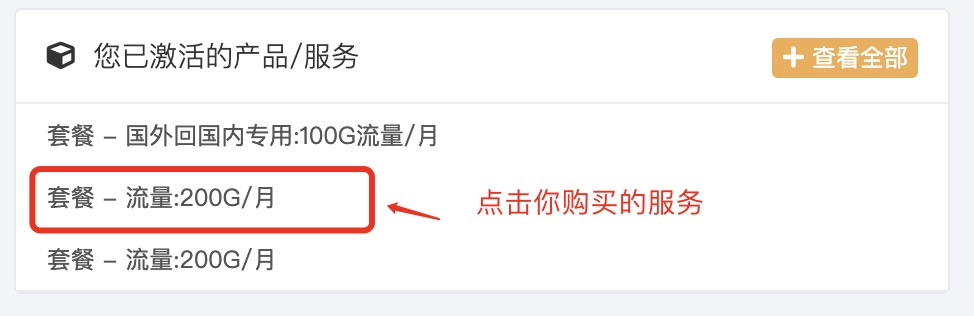
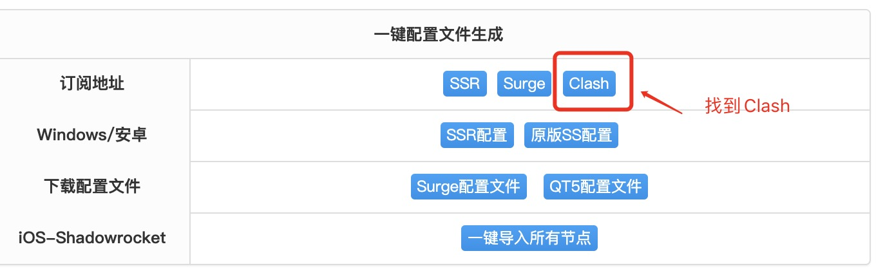
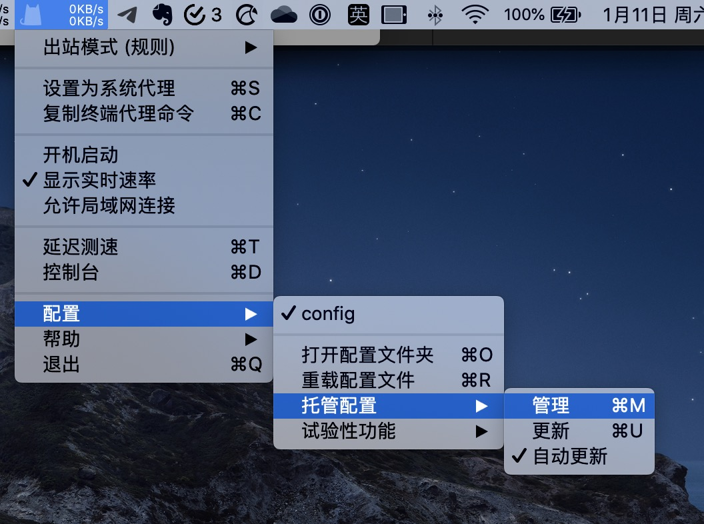
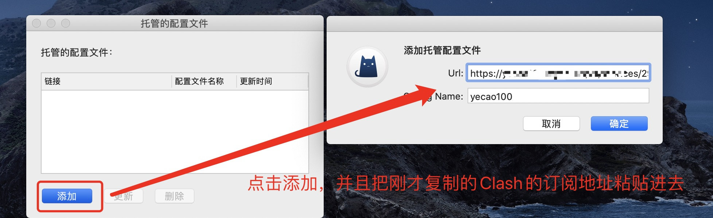
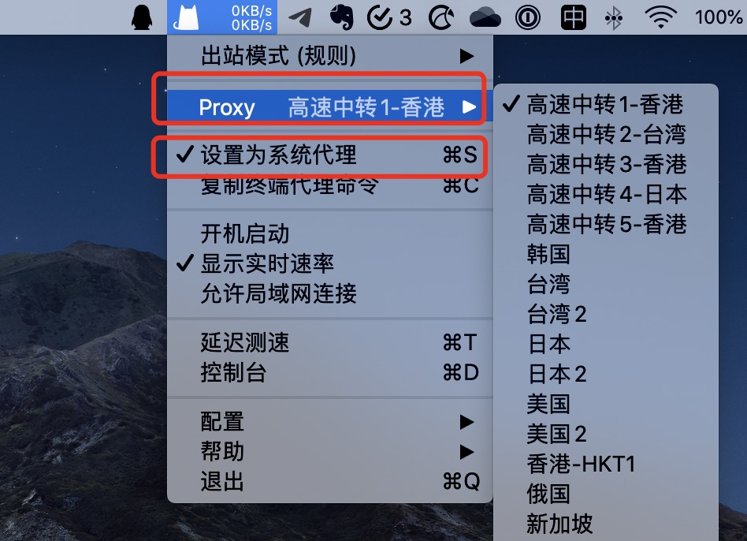

# MacOS

## 客户端下载并安装

ClashX客户端官方GitHub下载地址：[https://github.com/yichengchen/clashX/releases](https://github.com/yichengchen/clashX/releases)

请下载客户端并安装。

## 从网站获取订阅地址

1. 登陆网站后获取Clash配置文件的订阅托管地址

2. 在产品页面找到Clash的订阅按钮

3. 复制取得Clash的订阅地址


订阅地址包含了你个人的认证代码，请勿共享给任何人。


## 客户端配置

1. 选择菜单》配置》托管配置》管理

2. 把刚才复制的Clash的订阅地址粘贴进去并确认

3. 确认Proxy有限了后，勾选“设置为系统代理”即可正常上网

