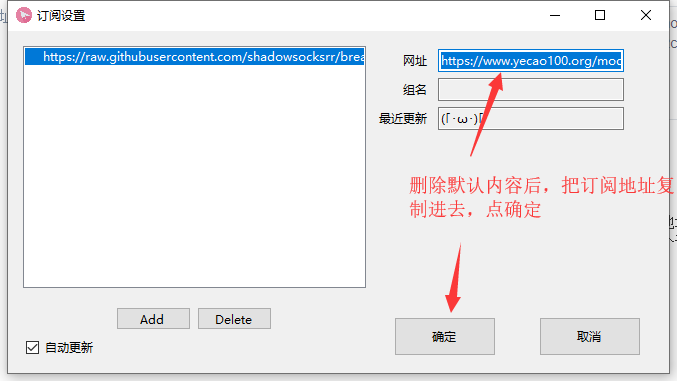
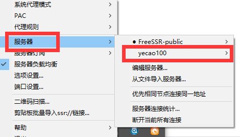
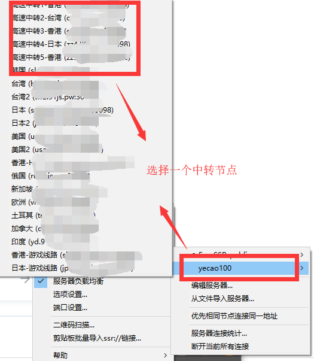
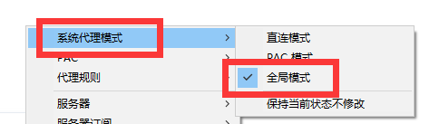
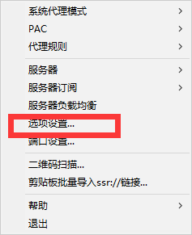
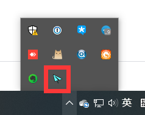

# Windows

## 下载客户端并安装

GitHub下载：[https://github.com/shadowsocksrr/shadowsocksr-csharp/releases](https://github.com/shadowsocksrr/shadowsocksr-csharp/releases)

## 从网站获取订阅地址

## 客户端配置

删除默认的内容后，把我们的订阅地址复制进去，并点确定

## 退出客户端


如果你发现，不开客户端的情况下无法正常上网，则说明你没有正常退出客户端



请确保每次退出客户端的时候，都是右键点击图标，然后选择”退出“菜单



如果不开客户端的时候无法上网，请再打开一下客户端，然后重新退出


