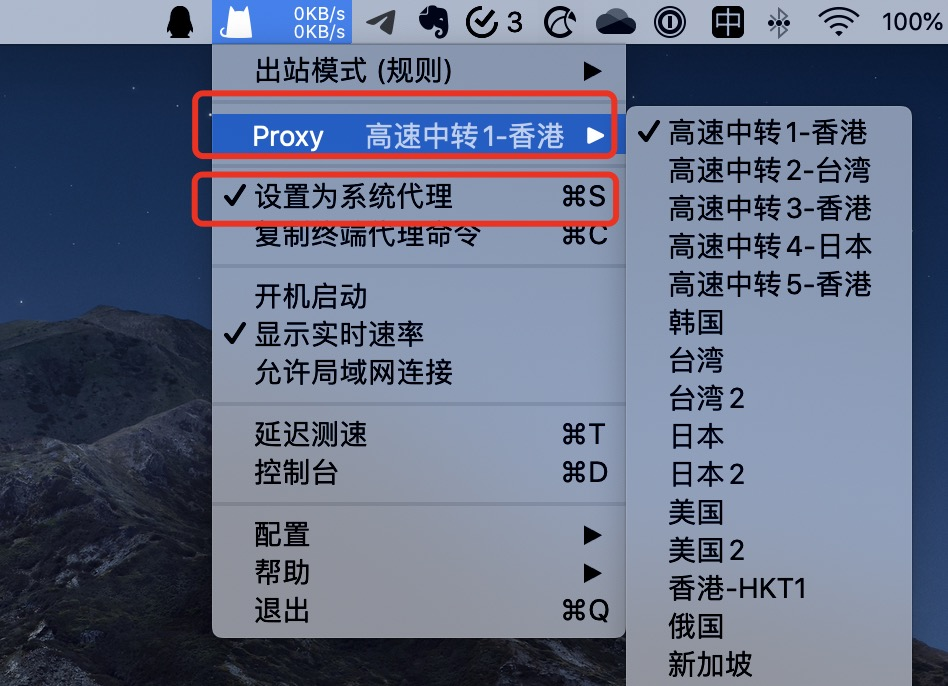

# （MacOS\)-ClashX

## 客户端下载并安装

ClashX客户端官方GitHub下载地址：[https://github.com/yichengchen/clashX/releases](https://github.com/yichengchen/clashX/releases)

请下载客户端并安装。

## 客户端配置

1. 登陆网站后获取Clash配置文件的订阅托管地址

2. 客户端设定Clash的订阅

